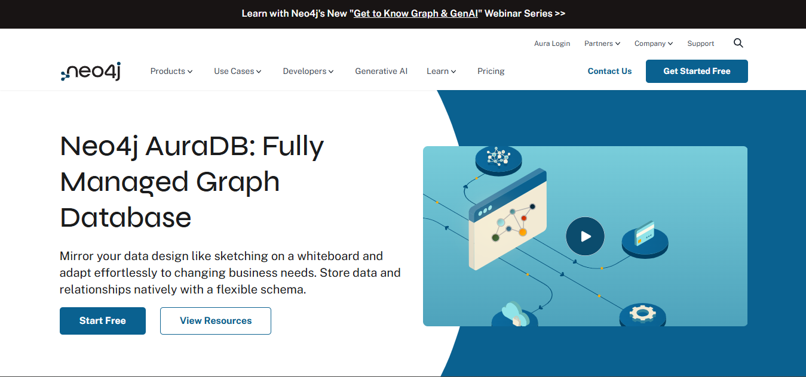
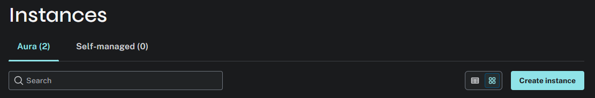
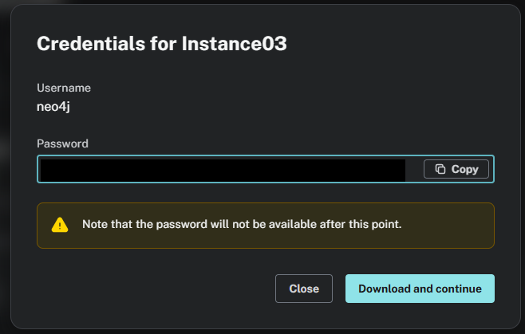
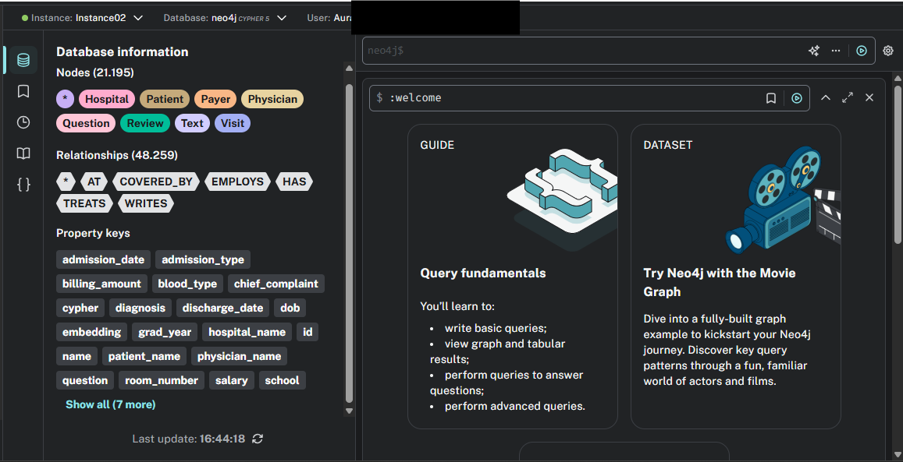
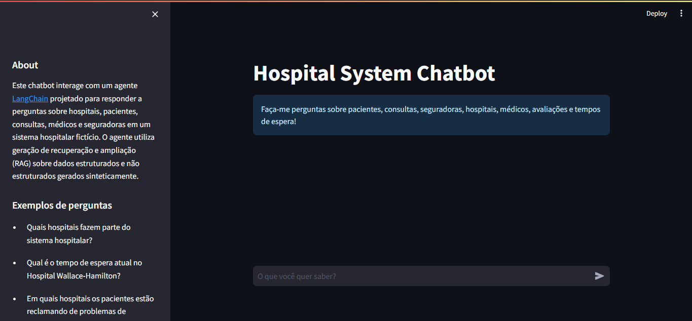

# Ransomware System Chatbot

Este repositório contém um chatbot para gerenciamento de informações hospitalares utilizando LangChain, Neo4j AuraDB e OpenAI.

## 📋 Requisitos Necessários

Antes de iniciar a configuração, certifique-se de ter os seguintes requisitos instalados no seu sistema:

- Python → necessário para criar o ambiente virtual e rodar scripts auxiliares.
- Docker → para rodar os containers da aplicação.
- Chave de API da OpenAI → necessária para integrar os modelos de linguagem no chatbot.

## ⚙️ Configuração do Ambiente

### 1. Crie um ambiente virtual

```python -m venv .venv```

#### Em seguida ative o ambiente

- Windows:

```.venv\Scripts\activate```

- macOS/Linux:

```source .venv/bin/activate```

### 2. Crie uma conta Neo4j e uma instância AuraDB

1. Acesse [Neo4j AuraDB Free](https://neo4j.com/cloud/aura-free/) 
2. Clique em **Start Free** e crie sua conta.




3. No console do **Neo4j** Aura, crie uma nova instância



4. Baixe o arquivo de credenciais da instância:



Com as credenciais baixadas, complete e salve o `.env` com as credenciais baixadas e a sua `OPENAI_API_KEY`:

```
OPENAI_API_KEY=

## dados
ACTOR_OPERATES_CSV_PATH=https://raw.githubusercontent.com/jonathasfsilva/xeque-mate/refs/heads/main/data/actor_operates_ransomware.csv
RANSOMWARE_DEMANDS_CSV_PATH=https://raw.githubusercontent.com/jonathasfsilva/xeque-mate/refs/heads/main/data/ransomware_demands_payment_to_wallet.csv
RANSOMWARE_TARGETED_CSV_PATH=https://raw.githubusercontent.com/jonathasfsilva/xeque-mate/refs/heads/main/data/ransomware_targeted_victim.csv
RANSOMWARE_CSV_PATH=https://raw.githubusercontent.com/jonathasfsilva/xeque-mate/refs/heads/main/data/ransomware.csv
THREAT_ACTORS_CSV_PATH=https://raw.githubusercontent.com/jonathasfsilva/xeque-mate/refs/heads/main/data/threat_actor.csv
VICTIM_CSV_PATH=https://raw.githubusercontent.com/jonathasfsilva/xeque-mate/refs/heads/main/data/victim.csv
WALLET_CSV_PATH=https://raw.githubusercontent.com/jonathasfsilva/xeque-mate/refs/heads/main/data/wallet.csv
REPORTS_CSV_PATH=https://raw.githubusercontent.com/jonathasfsilva/xeque-mate/refs/heads/main/data/reports.csv
REPORT_MENTIONS_ACTOR_CSV_PATH=https://raw.githubusercontent.com/jonathasfsilva/xeque-mate/refs/heads/main/data/report_mentions_actor.csv
REPORT_MENTIONS_RANSOMWARE_CSV_PATH=https://raw.githubusercontent.com/jonathasfsilva/xeque-mate/refs/heads/main/data/report_mentions_ransomware.csv

# NEO4J AQUI


CTI_QA_MODEL=gpt-3.5-turbo-0125
CTI_CYPHER_MODEL=gpt-3.5-turbo-1106
AGENT_MODEL=gpt-3.5-turbo-1106
CTI_AGENT_MODEL=gpt-3.5-turbo-1106


CHATBOT_URL=http://chatbot_api:8000/rag-agent
```
>⚠️ Importante: Aguarde cerca de 60 segundos após criar a instância antes de conectar, ou valide sua disponibilidade em console.neo4j.io
.

### 3. Rodar o projeto

```docker-compose up --build```

Quando o ETL terminar de ser executado, retorne ao console do Aura, será possível observar:

- Nodes
- Relationships
- Property keys
- ...



## Chatbot ✅

Abra o chatbot no seu browser:

[http://localhost:8501/](http://localhost:8501/)

